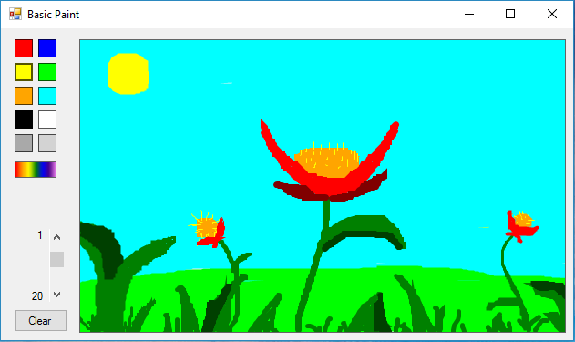

<h2>Basic Paint</h2>

Basic paint is a minimilistic painting programing that allows the user to : Clear the board, change brush size, and change brush color.

Update (V 1.05):

<ul>
<li>Recreated application</li>
<li>GUI redesign</li>
<li>Fixed line creation bug (<em>making a dot would crash the program since 2 or more points where need for lines</em>)</li>
<li>Added custom color option</li>
</ul>

Update (V 1.10):

<ul>
<li>Dynamic text box for brush size</li>
<li>Menu System (support loading and saving images)</li>
</ul>
