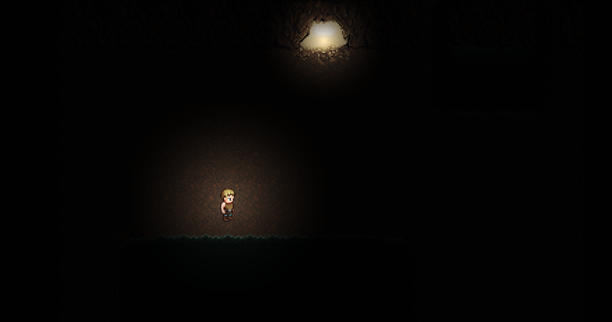

Note that the on-going proccess of this directory has been switched to a private repository. The commits from the private will be updated through this file below explaining the current state of the game.

Updates to the main game along with it's current progress will be recored here to give an idea where the project is at along with it's documentation.

---
<h3>Town RPG</h3>

</img>

*<h4>Version 0.04</h4>*

* Player Health bar, takes damage from enemies. (*planned*)
* Player Stamina bar, running and attack will take stamina. (*planned*)
* Player can now be knocked back from getting hit by enemies. (*planned*)
* Basic visual inventory system. (*planned*)
* Player can now pickup items. (*planned*) 
* Enemies have a change of dropping items. (*planned*)

**<h4>Version 0.03</h4>**

* Enemys now get pushed back from player hits and turn red when hit.
* Balanced player attack system, collisions line up with sword swings and attacks are more accurate.
* Code Restructured for beter scaleability and maintance.
* *Map* now includes a Texture class for adding 2D textures.
* Enemies are now placed using a second layer, each enemy has a certain location for each map. 
* Enemies now have health and can be killed.
* Basic menu system in progress (*small item storage, item sprites, menu sprites*) 
* Code Refactoring for better scalability (*Mostly for enemy classes*) 
  * Refactored collision Tiles, Added Enemy class with an Interface for general enemeies.

**<h4>Version 0.02</h4>**

* Added basic lighting system (*back world light and object light*), placed into *Map* class.
* Added Attacking Animation
* Enemy Slime Added (*Random Movement and collision system*)
* Tile Drawing is now optimized for large maps. Before-hand all tiles on the map where looped and drawn, now tiles are stored in a 2D array and are directly accessed for drawing based on the player position (*the visible tiles on the screen*).
* Collisions are now optimized for large maps. Now colliadable items only check collision with it's neightbooring tiles.
* Bug Fixed: Enemy timers causing frame stuttering, timer has been re-implmented and optimized.
* Slimes now follow player when player is close based on a radius distance.
* Added Player attack rectangle (*for hitting enemies*)

**<h4>**Version 0.01**</h4>**

* Player and walking animations.
* Tilemapping system.
* Tile Collisions with player
* Player Sprinting mechanic (*basic*)
* Added Fullscreen mode along with scaling
* Added Door functionality, player can now move between maps using doorways

---

*Notes:* 

A update will be made to this readme file whenever a commit is made in the private directory of this project. Some commits may seem trivial or may have counters on the end of a worked on item (*ex: foo - 9*) means there where 9 commits for task *"foo"*.

**Bolded** versions mean that version is complete, *italic* means the version is still in progress.
