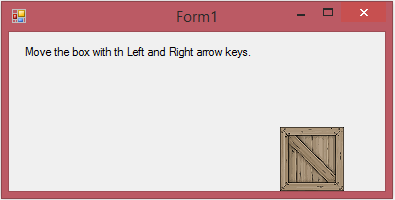

<h2>Keyboard Control</h2>

Basic keyboard control with an image, uses keyDown and keyUp events to change booleans that keep track of key events. Then for updating the screen we use a timer that goes off every 10 milliseconds that updated the position of the image depending on our boolean vaules. Just standard way for smooth (non-keyboard typing) movement. 

